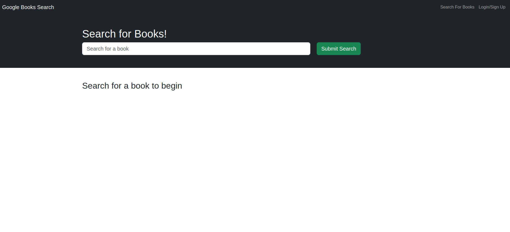
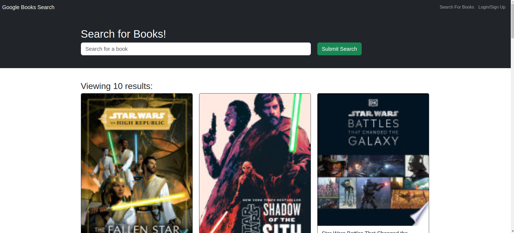
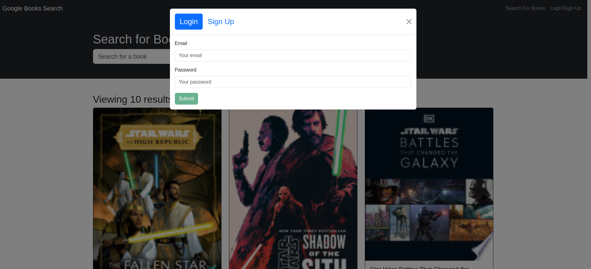
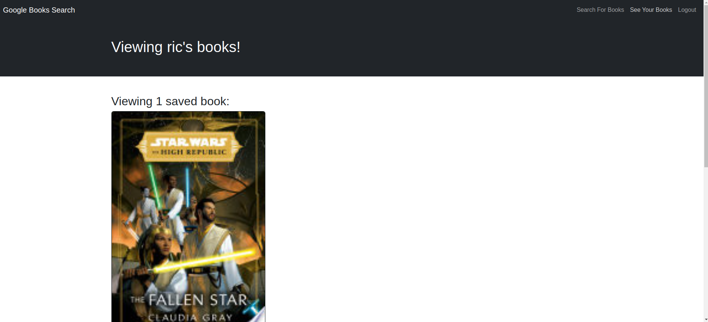

# module21

# Book Searching

## Description

The Book Searching allows avid readers to search for new books, keep track of books to purchase, and manage a personal list of saved books. The application integrates with the Google Books API to provide book details.

## User Story

**As an avid reader,**  
I want to search for new books to read  
So that I can keep a list of books to purchase.

## Acceptance Criteria

- **GIVEN** a book search engine  
  **WHEN** I load the search engine  
  **THEN** I am presented with a menu with the options "Search for Books" and "Login/Signup," an input field to search for books, and a submit button.
- **WHEN** I click on the "Search for Books" menu option  
  **THEN** I am presented with an input field to search for books and a submit button.
- **WHEN** I am not logged in, enter a search term in the input field, and click the submit button  
  **THEN** I am presented with several search results, each featuring a book’s title, author, description, image, and a link to that book on the Google Books site.
- **WHEN** I click on the "Login/Signup" menu option  
  **THEN** a modal appears on the screen with a toggle between the option to log in or sign up.
- **WHEN** the toggle is set to "Signup"  
  **THEN** I am presented with inputs for a username, an email address, a password, and a signup button.
- **WHEN** the toggle is set to "Login"  
  **THEN** I am presented with inputs for an email address, a password, and a login button.
- **WHEN** I enter a valid email address, create a password, and click the signup button  
  **THEN** my user account is created, and I am logged in to the site.
- **WHEN** I enter my account’s email address and password and click the login button  
  **THEN** the modal closes, and I am logged in to the site.
- **WHEN** I am logged in to the site  
  **THEN** the menu options change to "Search for Books," an option to see my saved books, and "Logout."
- **WHEN** I am logged in and enter a search term in the input field and click the submit button  
  **THEN** I am presented with search results featuring a book’s details and a button to save a book to my account.
- **WHEN** I click the "Save" button on a book  
  **THEN** that book’s information is saved to my account.
- **WHEN** I click on the option to see my saved books  
  **THEN** I am presented with all the books I have saved, each featuring the book’s details and a button to remove it from my account.
- **WHEN** I click the "Remove" button on a book  
  **THEN** that book is deleted from my saved books list.
- **WHEN** I click on the "Logout" button  
  **THEN** I am logged out of the site and presented with a menu with the options "Search for Books" and "Login/Signup," an input field to search for books, and a submit button.

## Screenshots

### Home Page

### Search Results

### Login Modal

### Saved Books

## Getting Started

1. Clone the repository.
2. Install dependencies using `npm install`.
3. Start the development server with `npm start`.

## Technologies Used

- React
- Node.js
- Google Books API
- Express
- MongoDB

## License

This project is licensed under the MIT License.
